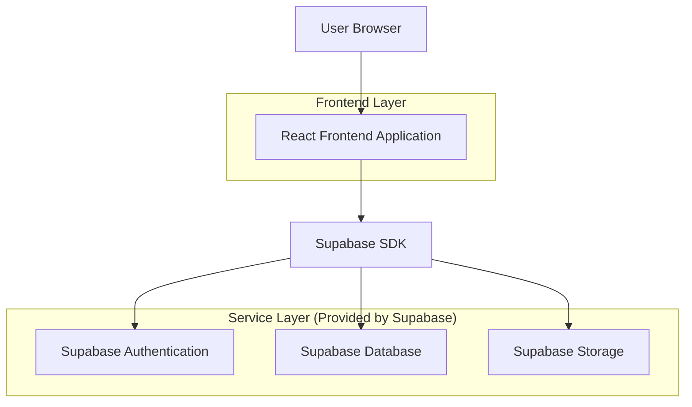
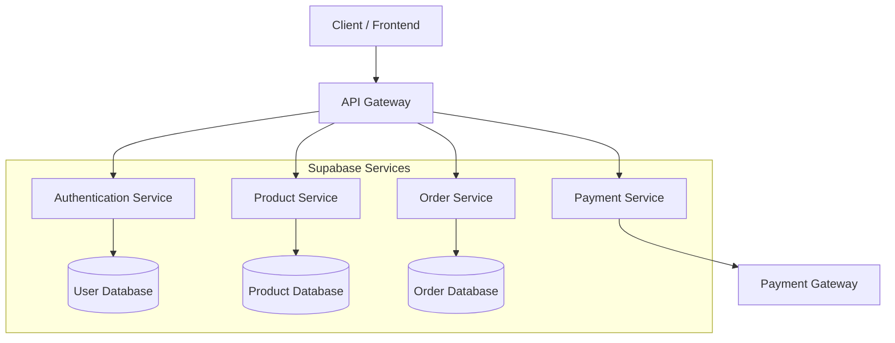
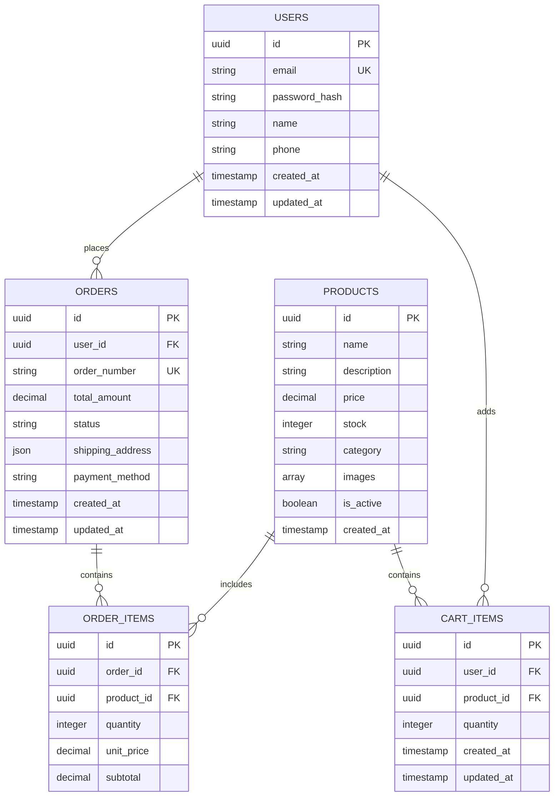

## 1. Architecture Design



## 2. Technology Description
- Frontend: React@18 + tailwindcss@3 + vite
- Initialization Tool: vite-init
- Backend: Supabase (Authentication, Database, Storage)
- State Management: React Context API
- Routing: React Router v6
- Payment Processing: Stripe integration

## 3. Route Definitions
| Route | Purpose |
|-------|---------|
| / | Home page with featured products and navigation |
| /products | Product catalog with filtering and sorting |
| /products/:id | Individual product detail page |
| /cart | Shopping cart with item management |
| /checkout | Multi-step checkout process |
| /order-confirmation/:id | Order success page with details |
| /login | User authentication |
| /register | New user registration |
| /profile | User account management |

## 4. API Definitions

### 4.1 Product Management APIs

**Get All Products**
```
GET /api/products
```

Query Parameters:
| Param Name | Param Type | isRequired | Description |
|------------|-------------|-------------|-------------|
| category | string | false | Filter by category |
| min_price | number | false | Minimum price filter |
| max_price | number | false | Maximum price filter |
| sort_by | string | false | Sort by price, name, or date |
| page | number | false | Page number for pagination |
| limit | number | false | Items per page |

Response:
| Param Name | Param Type | Description |
|------------|-------------|-------------|
| products | array | Array of product objects |
| total_count | number | Total number of products |
| page | number | Current page number |

**Get Product Details**
```
GET /api/products/:id
```

Response:
| Param Name | Param Type | Description |
|------------|-------------|-------------|
| id | string | Product unique identifier |
| name | string | Product name |
| description | string | Product description |
| price | number | Product price |
| images | array | Array of image URLs |
| category | string | Product category |
| stock | number | Available quantity |

### 4.2 Cart Management APIs

**Add to Cart**
```
POST /api/cart/add
```

Request:
| Param Name | Param Type | isRequired | Description |
|------------|-------------|-------------|-------------|
| product_id | string | true | Product identifier |
| quantity | number | true | Quantity to add |

**Update Cart Item**
```
PUT /api/cart/update
```

Request:
| Param Name | Param Type | isRequired | Description |
|------------|-------------|-------------|-------------|
| item_id | string | true | Cart item identifier |
| quantity | number | true | New quantity |

### 4.3 Order Management APIs

**Create Order**
```
POST /api/orders/create
```

Request:
| Param Name | Param Type | isRequired | Description |
|------------|-------------|-------------|-------------|
| items | array | true | Array of cart items |
| shipping_address | object | true | Shipping information |
| payment_method | string | true | Payment method type |

## 5. Server Architecture Diagram



## 6. Data Model

### 6.1 Data Model Definition



### 6.2 Data Definition Language

**Users Table**
```sql
-- Create users table
CREATE TABLE users (
    id UUID PRIMARY KEY DEFAULT gen_random_uuid(),
    email VARCHAR(255) UNIQUE NOT NULL,
    password_hash VARCHAR(255) NOT NULL,
    name VARCHAR(100) NOT NULL,
    phone VARCHAR(20),
    created_at TIMESTAMP WITH TIME ZONE DEFAULT NOW(),
    updated_at TIMESTAMP WITH TIME ZONE DEFAULT NOW()
);

-- Create index
CREATE INDEX idx_users_email ON users(email);
```

**Products Table**
```sql
-- Create products table
CREATE TABLE products (
    id UUID PRIMARY KEY DEFAULT gen_random_uuid(),
    name VARCHAR(255) NOT NULL,
    description TEXT,
    price DECIMAL(10,2) NOT NULL,
    stock INTEGER DEFAULT 0,
    category VARCHAR(100),
    images TEXT[],
    is_active BOOLEAN DEFAULT true,
    created_at TIMESTAMP WITH TIME ZONE DEFAULT NOW()
);

-- Create indexes
CREATE INDEX idx_products_category ON products(category);
CREATE INDEX idx_products_price ON products(price);
CREATE INDEX idx_products_active ON products(is_active);
```

**Cart Items Table**
```sql
-- Create cart_items table
CREATE TABLE cart_items (
    id UUID PRIMARY KEY DEFAULT gen_random_uuid(),
    user_id UUID REFERENCES users(id) ON DELETE CASCADE,
    product_id UUID REFERENCES products(id) ON DELETE CASCADE,
    quantity INTEGER NOT NULL DEFAULT 1,
    created_at TIMESTAMP WITH TIME ZONE DEFAULT NOW(),
    updated_at TIMESTAMP WITH TIME ZONE DEFAULT NOW(),
    UNIQUE(user_id, product_id)
);

-- Create indexes
CREATE INDEX idx_cart_items_user_id ON cart_items(user_id);
CREATE INDEX idx_cart_items_product_id ON cart_items(product_id);
```

**Orders Table**
```sql
-- Create orders table
CREATE TABLE orders (
    id UUID PRIMARY KEY DEFAULT gen_random_uuid(),
    user_id UUID REFERENCES users(id) ON DELETE CASCADE,
    order_number VARCHAR(20) UNIQUE NOT NULL,
    total_amount DECIMAL(10,2) NOT NULL,
    status VARCHAR(50) DEFAULT 'pending',
    shipping_address JSONB NOT NULL,
    payment_method VARCHAR(50) NOT NULL,
    created_at TIMESTAMP WITH TIME ZONE DEFAULT NOW(),
    updated_at TIMESTAMP WITH TIME ZONE DEFAULT NOW()
);

-- Create indexes
CREATE INDEX idx_orders_user_id ON orders(user_id);
CREATE INDEX idx_orders_status ON orders(status);
CREATE INDEX idx_orders_created_at ON orders(created_at DESC);
```

**Order Items Table**
```sql
-- Create order_items table
CREATE TABLE order_items (
    id UUID PRIMARY KEY DEFAULT gen_random_uuid(),
    order_id UUID REFERENCES orders(id) ON DELETE CASCADE,
    product_id UUID REFERENCES products(id) ON DELETE CASCADE,
    quantity INTEGER NOT NULL,
    unit_price DECIMAL(10,2) NOT NULL,
    subtotal DECIMAL(10,2) NOT NULL
);

-- Create indexes
CREATE INDEX idx_order_items_order_id ON order_items(order_id);
CREATE INDEX idx_order_items_product_id ON order_items(product_id);
```

**Supabase Row Level Security (RLS) Policies**
```sql
-- Enable RLS on tables
ALTER TABLE users ENABLE ROW LEVEL SECURITY;
ALTER TABLE products ENABLE ROW LEVEL SECURITY;
ALTER TABLE cart_items ENABLE ROW LEVEL SECURITY;
ALTER TABLE orders ENABLE ROW LEVEL SECURITY;
ALTER TABLE order_items ENABLE ROW LEVEL SECURITY;

-- Grant permissions
GRANT SELECT ON products TO anon;
GRANT ALL ON products TO authenticated;
GRANT ALL ON cart_items TO authenticated;
GRANT ALL ON orders TO authenticated;
GRANT ALL ON order_items TO authenticated;

-- Cart items policies
CREATE POLICY "Users can view their own cart items" ON cart_items
    FOR SELECT USING (auth.uid() = user_id);

CREATE POLICY "Users can manage their own cart items" ON cart_items
    FOR ALL USING (auth.uid() = user_id);

-- Orders policies
CREATE POLICY "Users can view their own orders" ON orders
    FOR SELECT USING (auth.uid() = user_id);

CREATE POLICY "Users can create their own orders" ON orders
    FOR INSERT WITH CHECK (auth.uid() = user_id);
```