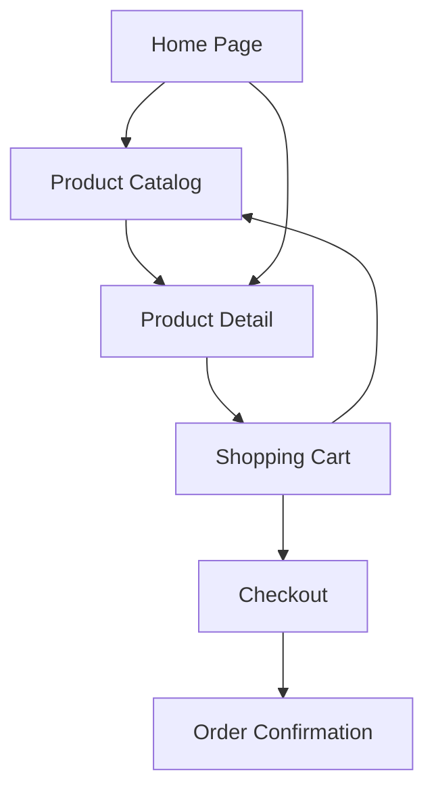

## 1. Product Overview
Ecommerce website for selling products online with modern shopping experience. Customers can browse products, view details, add to cart, and complete purchases securely. The platform targets small to medium businesses looking to establish online presence with professional storefront.

## 2. Core Features

### 2.1 User Roles
| Role | Registration Method | Core Permissions |
|------|---------------------|------------------|
| Guest User | No registration required | Browse products, view details, add to cart |
| Customer | Email registration | Complete purchases, view order history, manage profile |
| Admin | Admin panel setup | Manage products, orders, inventory, website settings |

### 2.2 Feature Module
Our ecommerce website consists of the following main pages:
1. **Home page**: hero section, featured products, navigation menu, search bar
2. **Product catalog page**: product grid, filtering, sorting, pagination
3. **Product detail page**: product images, description, price, add to cart, reviews
4. **Shopping cart page**: item list, quantity adjustment, price calculation, proceed to checkout
5. **Checkout page**: shipping info, payment method, order summary, place order
6. **Order confirmation page**: order details, confirmation number, next steps

### 2.3 Page Details
| Page Name | Module Name | Feature description |
|-----------|-------------|---------------------|
| Home page | Hero section | Display promotional banner with call-to-action button |
| Home page | Featured products | Show curated product selection in grid layout |
| Home page | Navigation menu | Provide access to product categories and pages |
| Home page | Search bar | Allow product search by keywords |
| Product catalog | Product grid | Display products in responsive grid with images and prices |
| Product catalog | Filters | Enable filtering by category, price range, availability |
| Product catalog | Sorting | Sort products by price, popularity, newest |
| Product catalog | Pagination | Navigate through large product sets efficiently |
| Product detail | Image gallery | Show multiple product images with zoom functionality |
| Product detail | Product info | Display name, price, description, specifications |
| Product detail | Add to cart | Select quantity and add product to shopping cart |
| Product detail | Reviews section | Show customer reviews and ratings |
| Shopping cart | Item list | Display selected products with images and prices |
| Shopping cart | Quantity control | Adjust item quantities with real-time price updates |
| Shopping cart | Remove items | Delete products from cart with confirmation |
| Shopping cart | Cart summary | Show subtotal, shipping, tax, and total amount |
| Shopping cart | Continue shopping | Return to catalog to add more items |
| Checkout | Shipping form | Collect delivery address and contact information |
| Checkout | Payment method | Support credit card and digital payment options |
| Checkout | Order summary | Display final order details before confirmation |
| Checkout | Place order | Process payment and create order |
| Order confirmation | Success message | Confirm successful order placement |
| Order confirmation | Order details | Show order number, items, shipping info |
| Order confirmation | Next steps | Provide tracking information and estimated delivery |

## 3. Core Process
**Customer Purchase Flow**: Browse products → View details → Add to cart → Review cart → Checkout → Payment → Order confirmation

## 4. User Interface Design

### 4.1 Design Style
- **Primary colors**: Modern blue (#2563eb) for primary actions, white background
- **Secondary colors**: Gray (#6b7280) for text, green (#10b981) for success states
- **Button style**: Rounded corners with hover effects and clear call-to-action
- **Font**: Clean sans-serif (Inter or system fonts), 16px base size
- **Layout style**: Card-based design with consistent spacing and shadows
- **Icons**: Modern line icons for navigation and actions

### 4.2 Page Design Overview
| Page Name | Module Name | UI Elements |
|-----------|-------------|-------------|
| Home page | Hero section | Full-width banner with overlay text, prominent CTA button in primary blue |
| Product catalog | Product grid | Responsive 4-column grid on desktop, 2-column on tablet, 1-column on mobile |
| Product detail | Image gallery | Left-aligned image carousel with thumbnail navigation and zoom on hover |
| Shopping cart | Item list | Clean table layout with product images, names, quantities, and prices |
| Checkout | Form sections | Multi-step form with clear progress indicator and validation feedback |

### 4.3 Responsiveness
Desktop-first design approach with mobile adaptation. Grid layouts adjust from 4 columns (desktop) to 2 columns (tablet) to 1 column (mobile). Touch-friendly buttons and navigation for mobile users.

### 4.4 SEO Optimization
- Semantic HTML structure with proper heading hierarchy
- Meta descriptions for all pages
- Product schema markup for rich snippets
- Optimized image alt text and file names
- Clean URL structure with product names
- XML sitemap generation