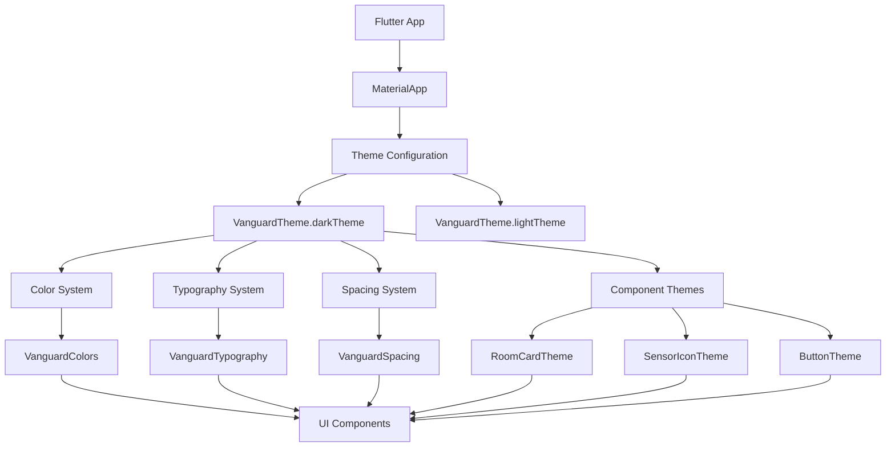
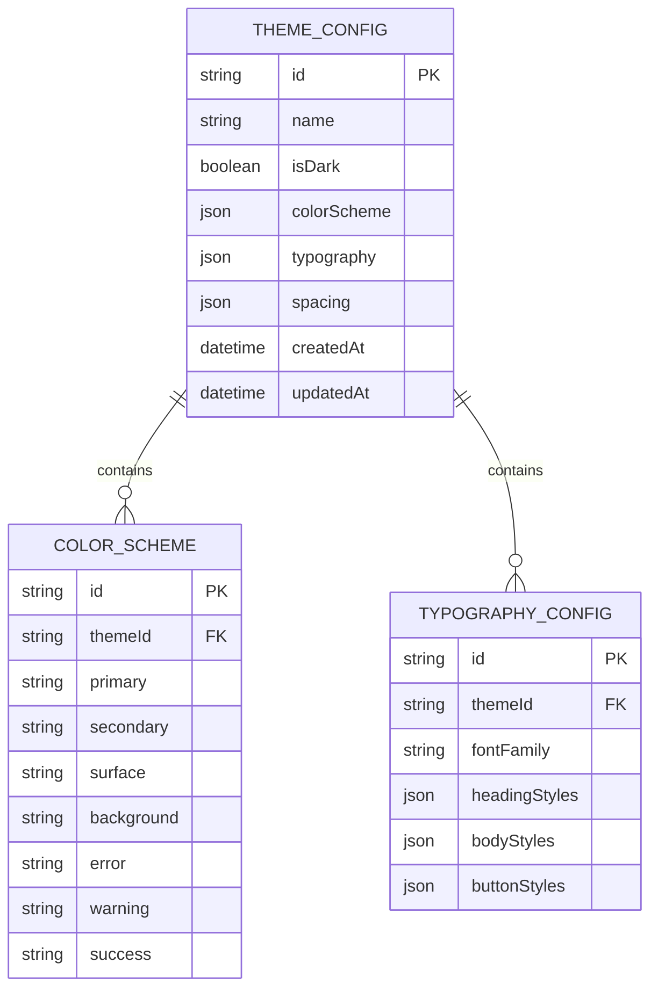

# Theme System Architecture

## 1. Architecture Design



## 2. Technology Description

### Core Technologies
- **Framework**: Flutter 3.3.0+
- **State Management**: Provider 6.0.0
- **Design System**: Material Design 3
- **Language**: Dart

### Dependencies
- `flutter`: Core Flutter framework
- `provider`: State management for theme switching
- `material_design_icons_flutter`: Extended icon set (optional)

## 3. Route Definitions

| Route | Purpose | Theme Integration |
|-------|---------|-------------------|
| `/` | Dashboard screen | Primary theme implementation |
| `/settings` | Theme settings | Theme switching interface |
| `/rooms/:id` | Room detail | Themed sensor displays |

## 4. Component Architecture

### 4.1 Theme Provider Structure
```dart
class ThemeProvider extends ChangeNotifier {
  ThemeData _currentTheme = VanguardTheme.darkTheme;
  bool _isDark = true;
  
  ThemeData get currentTheme => _currentTheme;
  bool get isDark => _isDark;
  
  void toggleTheme() {
    _isDark = !_isDark;
    _currentTheme = _isDark ? VanguardTheme.darkTheme : VanguardTheme.lightTheme;
    notifyListeners();
  }
  
  void setTheme(ThemeData theme) {
    _currentTheme = theme;
    notifyListeners();
  }
}
```

### 4.2 Theme Extension System
```dart
extension ThemeExtensions on BuildContext {
  VanguardColors get vanguardColors => VanguardColors();
  VanguardTypography get vanguardTypography => VanguardTypography();
  VanguardSpacing get vanguardSpacing => VanguardSpacing();
}
```

## 5. Data Models

### 5.1 Theme Configuration Model


### 5.2 Theme Constants Structure
```dart
// Core theme constants
abstract class ThemeConstants {
  // Border radius
  static const double borderRadiusSmall = 4.0;
  static const double borderRadiusMedium = 8.0;
  static const double borderRadiusLarge = 12.0;
  
  // Elevation
  static const double elevationCard = 2.0;
  static const double elevationButton = 4.0;
  static const double elevationAppBar = 0.0;
  
  // Animation durations
  static const Duration themeTransition = Duration(milliseconds: 300);
  static const Duration colorAnimation = Duration(milliseconds: 200);
}
```

## 6. Service Architecture

### 6.1 Theme Service Layer
```dart
class ThemeService {
  static ThemeData createCustomTheme({
    required Color primaryColor,
    required bool isDark,
    String? fontFamily,
  }) {
    return isDark 
      ? _createDarkTheme(primaryColor, fontFamily)
      : _createLightTheme(primaryColor, fontFamily);
  }
  
  static ThemeData _createDarkTheme(Color primaryColor, String? fontFamily) {
    return ThemeData.dark().copyWith(
      primaryColor: primaryColor,
      colorScheme: ColorScheme.dark(
        primary: primaryColor,
        secondary: primaryColor.withOpacity(0.7),
        surface: const Color(0xFF1E1E1E),
        background: const Color(0xFF121212),
      ),
      textTheme: fontFamily != null 
          ? Typography.blackCupertino.apply(fontFamily: fontFamily)
          : null,
    );
  }
}
```

### 6.2 Theme Persistence
```dart
class ThemePreferences {
  static const String _themeKey = 'selected_theme';
  static const String _isDarkKey = 'is_dark_theme';
  
  static Future<void> saveTheme(String themeId, bool isDark) async {
    final prefs = await SharedPreferences.getInstance();
    await prefs.setString(_themeKey, themeId);
    await prefs.setBool(_isDarkKey, isDark);
  }
  
  static Future<Map<String, dynamic>> loadTheme() async {
    final prefs = await SharedPreferences.getInstance();
    return {
      'themeId': prefs.getString(_themeKey) ?? 'default',
      'isDark': prefs.getBool(_isDarkKey) ?? true,
    };
  }
}
```

## 7. Component Integration

### 7.1 Themed Widget Structure
```dart
class ThemedRoomCard extends StatelessWidget {
  final Room room;
  final VoidCallback? onLightToggle;
  final VoidCallback? onModeActivate;
  
  const ThemedRoomCard({
    required this.room,
    this.onLightToggle,
    this.onModeActivate,
  });
  
  @override
  Widget build(BuildContext context) {
    final theme = Theme.of(context);
    final vanguardTheme = context.vanguardColors;
    
    return Card(
      elevation: ThemeConstants.elevationCard,
      shape: RoundedRectangleBorder(
        borderRadius: BorderRadius.circular(ThemeConstants.borderRadiusMedium),
      ),
      child: Container(
        decoration: BoxDecoration(
          gradient: LinearGradient(
            colors: [
              theme.cardColor,
              theme.cardColor.withOpacity(0.9),
            ],
          ),
        ),
        padding: const EdgeInsets.all(VanguardSpacing.md),
        child: Column(
          crossAxisAlignment: CrossAxisAlignment.start,
          children: [
            _buildHeader(context),
            const SizedBox(height: VanguardSpacing.sm),
            _buildSensorGrid(context),
            const Spacer(),
            _buildControls(context),
          ],
        ),
      ),
    );
  }
  
  Widget _buildHeader(BuildContext context) {
    return Row(
      mainAxisAlignment: MainAxisAlignment.spaceBetween,
      children: [
        Text(
          room.name,
          style: VanguardTypography.roomName.copyWith(
            color: Theme.of(context).textTheme.headlineSmall?.color,
          ),
        ),
        _buildOccupancyIndicator(context),
      ],
    );
  }
  
  Widget _buildSensorGrid(BuildContext context) {
    return GridView.count(
      shrinkWrap: true,
      crossAxisCount: 2,
      childAspectRatio: 2.5,
      physics: const NeverScrollableScrollPhysics(),
      children: [
        _buildSensorItem(
          context,
          icon: SensorIconTheme.temperature,
          color: SensorIconTheme.getIconColor('temperature'),
          value: '${room.temperature.toStringAsFixed(1)}°F',
        ),
        _buildSensorItem(
          context,
          icon: SensorIconTheme.humidity,
          color: SensorIconTheme.getIconColor('humidity'),
          value: '${room.humidity}%',
        ),
        _buildSensorItem(
          context,
          icon: SensorIconTheme.co2,
          color: SensorIconTheme.getIconColor('co2'),
          value: '${room.co2} ppm',
        ),
        _buildSensorItem(
          context,
          icon: SensorIconTheme.light,
          color: SensorIconTheme.getIconColor('light'),
          value: '${room.lightLevel}%',
        ),
      ],
    );
  }
  
  Widget _buildSensorItem(BuildContext context, {
    required IconData icon,
    required Color color,
    required String value,
  }) {
    return Row(
      children: [
        Icon(icon, color: color, size: 18),
        const SizedBox(width: VanguardSpacing.sm),
        Text(
          value,
          style: VanguardTypography.sensorValue.copyWith(
            color: Theme.of(context).textTheme.bodyMedium?.color,
          ),
        ),
      ],
    );
  }
  
  Widget _buildControls(BuildContext context) {
    return Row(
      children: [
        Expanded(
          child: ElevatedButton.icon(
            onPressed: onLightToggle,
            icon: const Icon(Icons.power_settings_new, size: 18),
            label: const Text('Light'),
            style: ElevatedButton.styleFrom(
              padding: const EdgeInsets.symmetric(vertical: VanguardSpacing.sm),
            ),
          ),
        ),
        const SizedBox(width: VanguardSpacing.md),
        Expanded(
          child: ElevatedButton(
            onPressed: onModeActivate,
            child: const Text('Night'),
            style: ElevatedButton.styleFrom(
              padding: const EdgeInsets.symmetric(vertical: VanguardSpacing.sm),
            ),
          ),
        ),
      ],
    );
  }
  
  Widget _buildOccupancyIndicator(BuildContext context) {
    return Container(
      padding: const EdgeInsets.symmetric(
        horizontal: VanguardSpacing.sm,
        vertical: VanguardSpacing.xs,
      ),
      decoration: BoxDecoration(
        color: room.occupancy > 0 
          ? VanguardColors.success.withOpacity(0.2)
          : Colors.grey.withOpacity(0.2),
        borderRadius: BorderRadius.circular(ThemeConstants.borderRadiusSmall),
      ),
      child: Row(
        mainAxisSize: MainAxisSize.min,
        children: [
          Icon(
            SensorIconTheme.occupancy,
            size: 16,
            color: room.occupancy > 0 ? VanguardColors.success : Colors.grey,
          ),
          const SizedBox(width: VanguardSpacing.xs),
          Text(
            '${room.occupancy}',
            style: TextStyle(
              color: room.occupancy > 0 ? VanguardColors.success : Colors.grey,
              fontWeight: FontWeight.bold,
            ),
          ),
        ],
      ),
    );
  }
}
```

## 8. Testing Strategy

### 8.1 Theme Unit Tests
```dart
void main() {
  group('VanguardTheme', () {
    test('should create consistent dark theme', () {
      final theme = VanguardTheme.darkTheme;
      
      expect(theme.primaryColor, VanguardColors.primary);
      expect(theme.scaffoldBackgroundColor, VanguardColors.background);
      expect(theme.cardColor, VanguardColors.cardBackground);
    });
    
    test('should maintain color contrast ratios', () {
      final theme = VanguardTheme.darkTheme;
      final textColor = theme.textTheme.bodyLarge?.color;
      final backgroundColor = theme.scaffoldBackgroundColor;
      
      // Verify WCAG contrast ratio
      expect(calculateContrastRatio(textColor!, backgroundColor), greaterThan(4.5));
    });
  });
}
```

### 8.2 Widget Integration Tests
```dart
void main() {
  testWidgets('ThemedRoomCard should apply theme correctly', (tester) async {
    final testRoom = Room(
      id: 'test',
      name: 'Test Room',
      occupancy: 2,
      temperature: 72.5,
      humidity: 45,
      co2: 400,
      lightLevel: 75,
    );
    
    await tester.pumpWidget(
      MaterialApp(
        theme: VanguardTheme.darkTheme,
        home: Scaffold(
          body: ThemedRoomCard(room: testRoom),
        ),
      ),
    );
    
    // Verify theme application
    expect(find.text('Test Room'), findsOneWidget);
    expect(find.byType(Card), findsOneWidget);
    
    // Verify sensor data display
    expect(find.text('72.5°F'), findsOneWidget);
    expect(find.text('45%'), findsOneWidget);
    expect(find.text('400 ppm'), findsOneWidget);
    expect(find.text('75%'), findsOneWidget);
  });
}
```

## 9. Performance Optimization

### 9.1 Theme Caching
```dart
class ThemeCache {
  static final Map<String, ThemeData> _cache = {};
  
  static ThemeData? getCachedTheme(String key) {
    return _cache[key];
  }
  
  static void cacheTheme(String key, ThemeData theme) {
    _cache[key] = theme;
  }
  
  static void clearCache() {
    _cache.clear();
  }
}
```

### 9.2 Efficient Theme Switching
```dart
class EfficientThemeProvider extends ChangeNotifier {
  ThemeData _currentTheme = VanguardTheme.darkTheme;
  bool _isAnimating = false;
  
  ThemeData get currentTheme => _currentTheme;
  bool get isAnimating => _isAnimating;
  
  Future<void> switchTheme(ThemeData newTheme) async {
    if (_isAnimating) return;
    
    _isAnimating = true;
    notifyListeners();
    
    // Apply theme with animation
    await Future.delayed(ThemeConstants.themeTransition);
    
    _currentTheme = newTheme;
    _isAnimating = false;
    notifyListeners();
  }
}
```

## 10. Deployment Considerations

### 10.1 Asset Optimization
- Minimize theme asset sizes
- Use vector graphics for scalable icons
- Implement lazy loading for theme resources

### 10.2 Platform-Specific Adaptations
```dart
class PlatformThemeAdapter {
  static ThemeData adaptForPlatform(ThemeData baseTheme, TargetPlatform platform) {
    switch (platform) {
      case TargetPlatform.iOS:
        return baseTheme.copyWith(
          // iOS-specific adaptations
        );
      case TargetPlatform.android:
        return baseTheme.copyWith(
          // Android-specific adaptations
        );
      default:
        return baseTheme;
    }
  }
}
```

This architecture provides a robust, scalable foundation for implementing a comprehensive theme system that can be shared across multiple applications while maintaining consistency and performance.