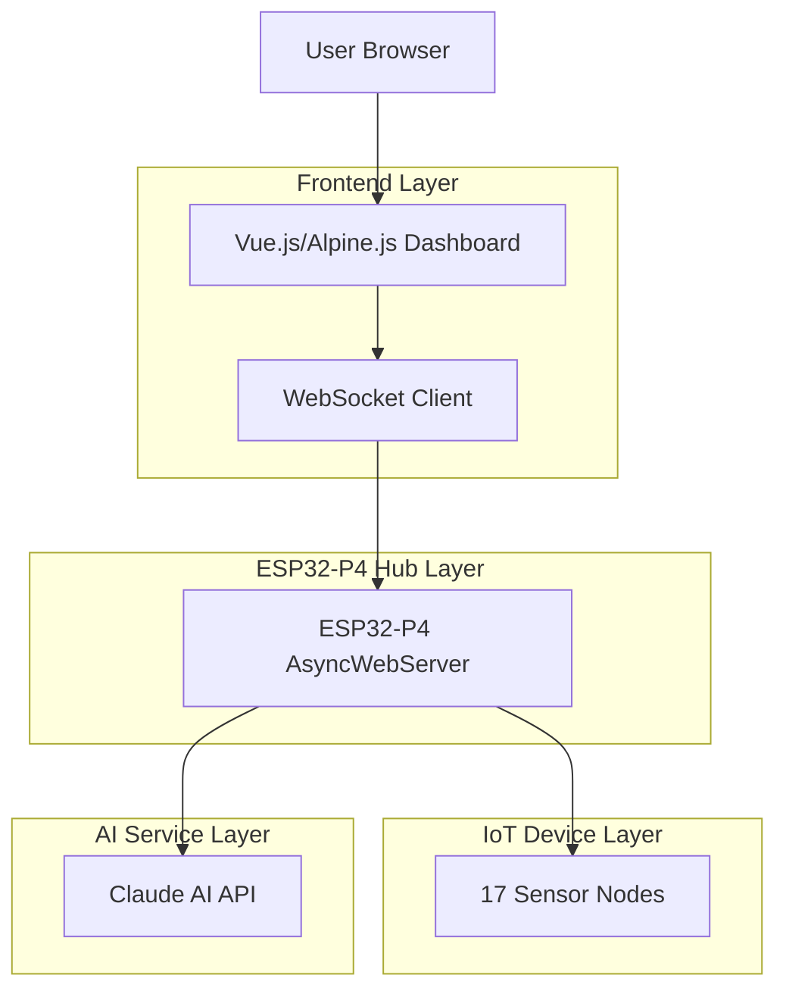
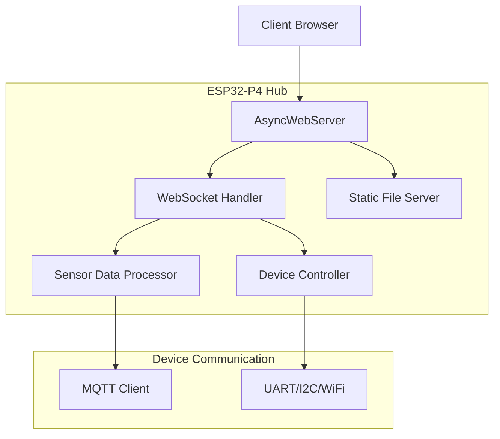
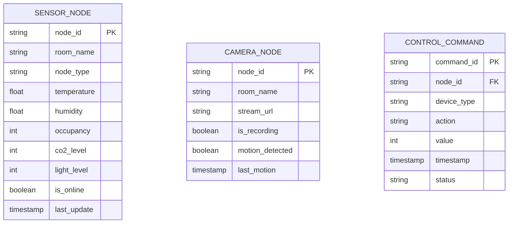

## 1. Architecture Design



## 2. Technology Description
- **Frontend**: Vue.js Petite OR Alpine.js (lightweight <100KB)
- **Web Server**: AsyncWebServer on ESP32-P4
- **Real-time**: WebSocket protocol (NOT polling)
- **Storage**: SPIFFS/LittleFS on ESP32 flash
- **Styling**: CSS Grid + Dark Mode cyberpunk aesthetic
- **Backend**: ESP32-P4 C++ (AsyncWebServer + WebSocket handling)
- **Database**: None (real-time sensor data only)

## 3. Route Definitions
| Route | Purpose |
|-------|---------|
| / | Dashboard homepage with HUD and live telemetry |
| /cameras | Camera feeds grid with MJPEG streams |
| /control | Control panel with quick actions and automation |
| /ws | WebSocket endpoint for real-time data |

## 4. API Definitions

### 4.1 WebSocket API
**Connection:** `ws://192.168.1.100/ws`

**Incoming Messages (Server → Client):**
```json
{
  "type": "sensor_update",
  "node": "living_room",
  "temp": 72.5,
  "humidity": 45,
  "occupancy": 2,
  "co2": 420,
  "light_level": 60
}
```

**Outgoing Messages (Client → Server):**
```json
{
  "type": "control",
  "room": "living_room",
  "device": "light",
  "value": 80
}
```

### 4.2 HTTP API
**System State:** `GET /api/state`
**Response:**
```json
{
  "nodes_online": 17,
  "system_health": "healthy",
  "ai_insights": ["Bedroom is 4°F warmer than hallway"]
}
```

## 5. Server Architecture Diagram



## 6. Data Model

### 6.1 Sensor Data Structure


### 6.2 ESP32-P4 Data Structures
**Sensor Node Data:**
```cpp
struct SensorData {
  String nodeId;
  String roomName;
  float temperature;
  float humidity;
  int occupancy;
  int co2Level;
  int lightLevel;
  bool isOnline;
  unsigned long lastUpdate;
};
```

**WebSocket Message Handler:**
```cpp
void handleWebSocketMessage(String message) {
  DynamicJsonDocument doc(1024);
  deserializeJson(doc, message);
  
  String type = doc["type"];
  if (type == "control") {
    String room = doc["room"];
    String device = doc["device"];
    int value = doc["value"];
    executeControlCommand(room, device, value);
  }
}
```