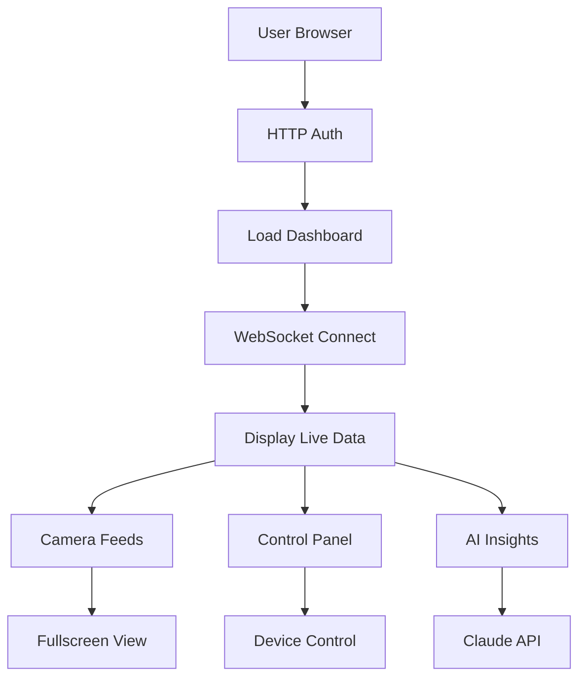

## 1. Product Overview
ESP32-P4 Web Dashboard for AI-powered smart home Mission Control interface. Real-time command center displaying sensor data, AI insights, camera feeds, and home automation controls for 17-device IoT system.

Target users: Smart home owners who need centralized control and monitoring of their AI-coordinated home automation system.

## 2. Core Features

### 2.1 User Roles
| Role | Registration Method | Core Permissions |
|------|---------------------|------------------|
| Home Owner | Basic HTTP Auth | Full dashboard access, device control, AI insights |
| Guest User | Session-based | View-only access to dashboard, no control permissions |

### 2.2 Feature Module
Our Mission Control dashboard consists of the following main pages:
1. **Dashboard**: Real-time HUD with system health, 17 device nodes status, live telemetry grid
2. **Camera Feeds**: MJPEG video streams from ESP32-S3 cameras with face detection overlay
3. **Control Panel**: Quick action modes (Night/Movie/Away/Emergency) and automation rules builder

### 2.3 Page Details
| Page Name | Module Name | Feature description |
|-----------|-------------|---------------------|
| Dashboard | HUD Header | Display system heartbeat, active node count, global alert status with color-coded indicators |
| Dashboard | Live Telemetry Grid | Show room tiles with occupancy count, temperature/humidity, CO₂ levels, light status, camera thumbnails |
| Dashboard | AI Officer Sidebar | Real-time AI recommendations from Claude API, contextual alerts, dismissible notifications |
| Camera Feeds | Video Grid | Display MJPEG streams from 10 ESP32-S3 cameras, click-to-expand fullscreen, record/snapshot buttons |
| Camera Feeds | Face Detection | Overlay bounding boxes on video feeds, motion detection alerts |
| Control Panel | Quick Actions | One-click modes: Night (dim lights, arm security), Movie (dim living room), Away (arm sensors), Emergency (unlock doors, all lights) |
| Control Panel | Automation Builder | Drag-and-drop IF/THEN logic builder, schedule-based triggers, sensor-action rules |

## 3. Core Process
**User Flow:**
1. User accesses http://192.168.1.100 on local network
2. Basic HTTP authentication validates credentials
3. WebSocket connection established for real-time data
4. Dashboard loads with current system state from ESP32-P4
5. Live sensor updates stream via WebSocket every 100ms
6. User can view camera feeds, control devices, receive AI insights

## 4. User Interface Design

### 4.1 Design Style
- **Primary Color**: `#00f0ff` (cyan for data)
- **Secondary Colors**: `#ffaa00` (amber warnings), `#ff3366` (red critical)
- **Background**: `#0a0e1a` (deep dark blue)
- **Text**: `#e0e6ed` (light gray)
- **Typography**: Headers 'Orbitron' (sci-fi), Body 'Inter' (clean)
- **Button Style**: Rounded corners with cyberpunk glow effects
- **Layout**: CSS Grid with card-based room tiles
- **Icons**: Font Awesome embedded (no external CDN)

### 4.2 Page Design Overview
| Page Name | Module Name | UI Elements |
|-----------|-------------|-------------|
| Dashboard | HUD Header | Cyan heartbeat pulse, green/red status indicators, node count badge with orbitron font |
| Dashboard | Room Tiles | Dark cards with cyan data text, amber warning highlights, rounded corners with hover glow |
| Dashboard | AI Sidebar | Sliding panel from right, amber insight text, dismiss buttons with cyberpunk styling |
| Camera Feeds | Video Grid | 2x2 grid layout, rounded video containers, red record buttons, face detection overlays |
| Control Panel | Quick Actions | Large square buttons with icons, color-coded by function, hover animations |

### 4.3 Responsiveness
- **Desktop-first** approach with mobile optimization
- **Breakpoints**: Desktop (>1200px), Tablet (768-1199px), Mobile (<768px)
- **Mobile features**: Hamburger menu, swipe navigation, bottom navbar
- **Performance**: <100KB total bundle size, <2s load time, <100ms WebSocket latency