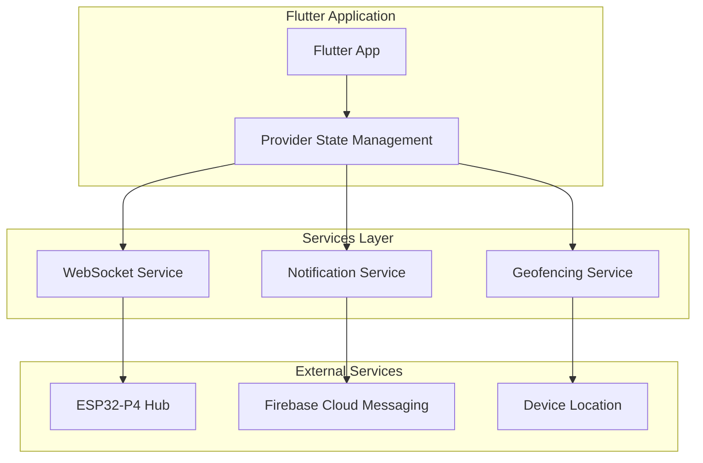
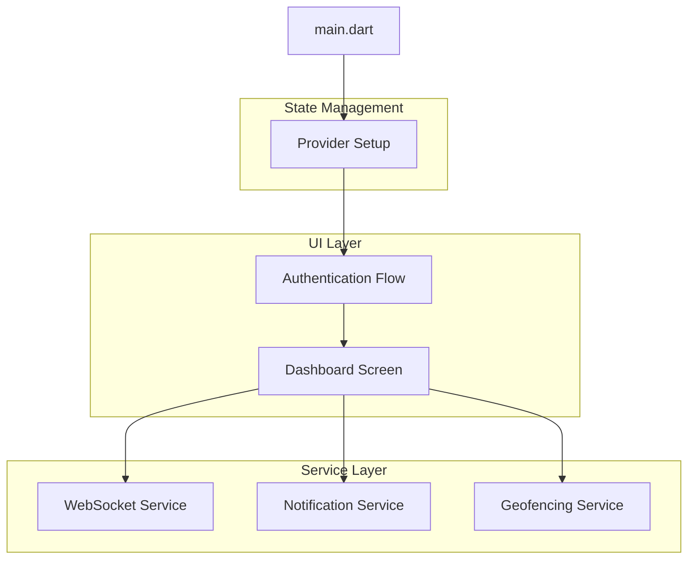

## 1. Architecture Design



## 2. Technology Description

* **Framework**: Flutter 3.x with Dart

* **State Management**: Provider pattern for reactive UI

* **WebSocket**: web\_socket\_channel for real-time communication

* **Notifications**: flutter\_local\_notifications + Firebase Cloud Messaging

* **Geofencing**: geolocator plugin for location monitoring

* **Authentication**: local\_auth for biometric authentication

* **Secure Storage**: flutter\_secure\_storage for tokens

* **HTTP**: http package for REST API calls

* **Platform**: Single codebase for iOS and Android

## 3. Route Definitions

| Route        | Purpose                           |
| ------------ | --------------------------------- |
| /login       | Biometric authentication screen   |
| /dashboard   | Main dashboard with room overview |
| /camera/{id} | Individual camera feed viewer     |
| /control     | Device control panel              |
| /settings    | App configuration and preferences |

## 4. API Definitions

### 4.1 WebSocket API

**Connection:** `ws://192.168.1.100/ws`

**Incoming Messages (Hub → App):**

```dart
class SensorUpdate {
  final String node;
  final double temp;
  final int occupancy;
  final int co2;
  final int lightLevel;
  
  SensorUpdate.fromJson(Map<String, dynamic> json)
    : node = json['node'],
      temp = json['temp'],
      occupancy = json['occupancy'],
      co2 = json['co2'],
      lightLevel = json['light_level'];
}
```

**Outgoing Messages (App → Hub):**

```dart
class ControlCommand {
  final String type = 'control';
  final String room;
  final String device;
  final int value;
  
  ControlCommand(this.room, this.device, this.value);
  
  Map<String, dynamic> toJson() => {
    'type': type,
    'room': room,
    'device': device,
    'value': value,
  };
}
```

### 4.2 REST API

**System Status:** `GET http://192.168.1.100/api/status`
**Response:**

```json
{
  "nodes_online": 17,
  "system_health": "healthy",
  "ai_insights": ["Bedroom is 4°F warmer than hallway"],
  "timestamp": "2024-01-15T10:30:00Z"
}
```

**Camera Streams:** `GET http://192.168.1.100/api/cameras`
**Response:**

```json
[
  {
    "id": "living_room_cam",
    "name": "Living Room",
    "stream_url": "http://192.168.1.100:8080/stream/living_room",
    "is_online": true
  }
]
```

## 5. Application Architecture



### 5.1 Project Structure

```
lib/
├── main.dart                    # App entry point
├── models/
│   ├── sensor_data.dart         # Sensor data models
│   ├── room.dart                # Room entity
│   ├── device.dart              # Device entity
│   └── camera.dart              # Camera entity
├── services/
│   ├── websocket_service.dart   # WebSocket connection
│   ├── api_service.dart         # REST API calls
│   ├── notification_service.dart # Push notifications
│   ├── geofencing_service.dart  # Location monitoring
│   ├── auth_service.dart        # Biometric authentication
│   └── secure_storage.dart      # Token management
├── providers/
│   ├── system_provider.dart     # Global app state
│   ├── room_provider.dart       # Room data management
│   └── camera_provider.dart     # Camera feed management
├── screens/
│   ├── login_screen.dart
│   ├── dashboard_screen.dart
│   ├── room_detail_screen.dart
│   ├── camera_screen.dart
│   ├── control_screen.dart
│   └── settings_screen.dart
└── widgets/
    ├── room_tile.dart
    ├── sensor_gauge.dart
    ├── camera_preview.dart
    └── control_button.dart
```

## 6. State Management

### 6.1 System State Provider

```dart
graph TD
  A[Flutter App] --> B[Provider State Management]
  B --> C[WebSocket Service]
  B --> D[Notification Service]
  B --> E[Geofencing Service]
  C --> F[ESP32-P4 Hub]
  D --> G[Firebase Cloud Messaging]
  E --> H[Device Location]
  
  subgraph "Flutter Application"
    A
    B
  end
  
  subgraph "Services Layer"
    C
    D
    E
  end
  
  subgraph "External Services"
    F
    G
    H
  end
```

### 6.2 WebSocket Service

```dart
class WebSocketService {
  final String hubUrl = 'ws://192.168.1.100/ws';
  WebSocketChannel? _channel;
  final StreamController<SensorUpdate> _sensorController = 
    StreamController<SensorUpdate>.broadcast();
  
  Stream<SensorUpdate> get sensorStream => _sensorController.stream;
  
  Future<void> connect() async {
    try {
      _channel = WebSocketChannel.connect(Uri.parse(hubUrl));
      _channel!.stream.listen(
        (message) => _handleMessage(message),
        onError: (error) => _handleError(error),
        onDone: () => _handleDisconnection(),
      );
    } catch (e) {
      print('WebSocket connection failed: $e');
      _scheduleReconnect();
    }
  }
  
  void _handleMessage(String message) {
    final data = jsonDecode(message);
    if (data['type'] == 'sensor_update') {
      final update = SensorUpdate.fromJson(data);
      _sensorController.add(update);
    }
  }
  
  void sendCommand(ControlCommand command) {
    _channel?.sink.add(jsonEncode(command.toJson()));
  }
}
```

## 7. Security Implementation

### 7.1 Biometric Authentication

```dart
class AuthService {
  final LocalAuthentication _localAuth = LocalAuthentication();
  final FlutterSecureStorage _secureStorage = FlutterSecureStorage();
  
  Future<bool> authenticate() async {
    try {
      final bool canCheckBiometrics = await _localAuth.canCheckBiometrics;
      final bool isDeviceSupported = await _localAuth.isDeviceSupported();
      
      if (canCheckBiometrics && isDeviceSupported) {
        return await _localAuth.authenticate(
          localizedReason: 'Access your Mission Control',
          options: AuthenticationOptions(
            biometricOnly: false,
            stickyAuth: true,
          ),
        );
      }
      return false;
    } catch (e) {
      return false;
    }
  }
  
  Future<void> storeToken(String token) async {
    await _secureStorage.write(key: 'auth_token', value: token);
  }
  
  Future<String?> getToken() async {
    return await _secureStorage.read(key: 'auth_token');
  }
}
```

### 7.2 Push Notification Configuration

```dart
graph TD
  A[Flutter App] --> B[Provider State Management]
  B --> C[WebSocket Service]
  B --> D[Notification Service]
  B --> E[Geofencing Service]
  C --> F[ESP32-P4 Hub]
  D --> G[Firebase Cloud Messaging]
  E --> H[Device Location]
  
  subgraph "Flutter Application"
    A
    B
  end
  
  subgraph "Services Layer"
    C
    D
    E
  end
  
  subgraph "External Services"
    F
    G
    H
  end
```

