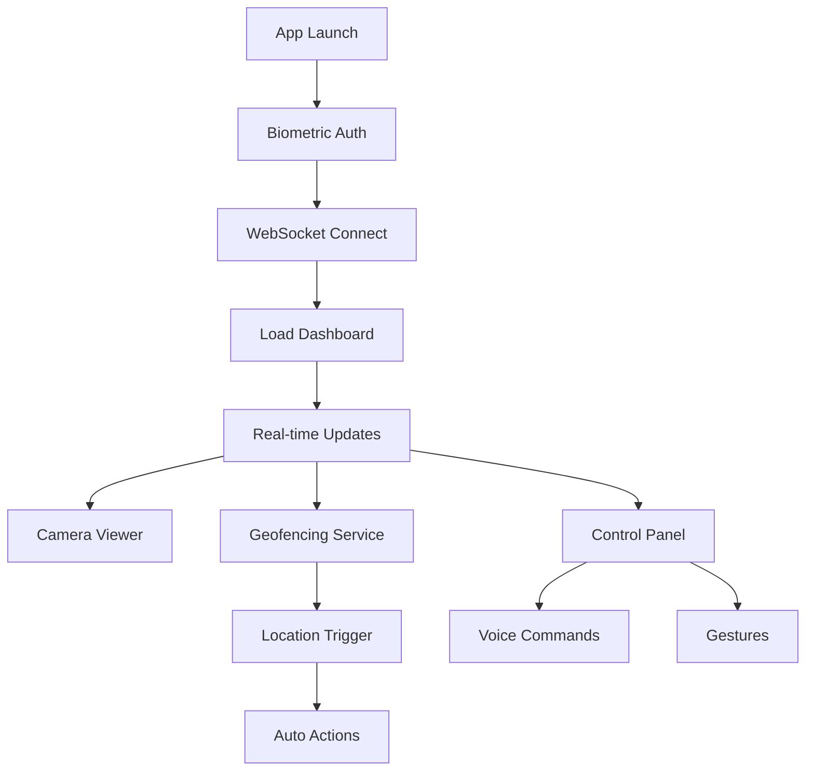

## 1. Product Overview
Flutter mobile app for AI-powered smart home Mission Control interface. Real-time remote monitoring and control of 17-device IoT system with biometric authentication, push notifications, and geofencing automation.

Target users: Smart home owners who need mobile access to monitor and control their AI-coordinated home automation system with security and convenience features.

## 2. Core Features

### 2.1 User Roles
| Role | Registration Method | Core Permissions |
|------|---------------------|------------------|
| Home Owner | Biometric + PIN | Full app access, device control, geofencing, notifications |
| Guest User | Temporary PIN | View-only access, limited control permissions |

### 2.2 Feature Module
Our Mission Control mobile app consists of the following main screens:
1. **Login**: Biometric authentication with FaceID/TouchID/Fingerprint fallback
2. **Dashboard**: Real-time room status, swipe navigation, pull-to-refresh
3. **Camera Viewer**: Full-screen video feeds, picture-in-picture, motion alerts
4. **Control Panel**: Quick toggles, voice commands, gesture shortcuts
5. **Settings**: Geofencing radius, notification preferences, security options

### 2.3 Page Details
| Page Name | Module Name | Feature description |
|-----------|-------------|---------------------|
| Login | Biometric Auth | FaceID/TouchID/Fingerprint authentication with 4-digit PIN fallback, secure token storage |
| Dashboard | Room Overview | Mirror web dashboard data, swipe between rooms, current location priority, occupancy counts |
| Dashboard | Real-time Updates | WebSocket connection to ESP32-P4, pull-to-refresh manual sync, offline caching |
| Camera Viewer | Video Feeds | Full-screen MJPEG streams from 10 ESP32-S3 cameras, pinch-to-zoom, picture-in-picture mode |
| Camera Viewer | Motion Detection | Push notifications for motion alerts, thumbnail preview in notification, quick access to feed |
| Control Panel | Quick Toggles | Lights, locks, HVAC controls with large touch targets, haptic feedback on actions |
| Control Panel | Voice Commands | "Status report", "Turn off living room lights" with speech-to-text processing |
| Control Panel | Gesture Shortcuts | Shake phone for emergency mode, double-tap for quick actions, swipe for room navigation |
| Settings | Geofencing | 5-mile radius auto-detection, arm/disarm security, HVAC eco mode, departure/arrival actions |
| Settings | Push Notifications | Critical alerts (motion detected), AI insights (overheating), system status (battery low), custom rules |

## 3. Core Process
**User Authentication Flow:**
1. User launches app, biometric prompt appears
2. FaceID/TouchID validates identity (or PIN fallback)
3. Secure bearer token retrieved from encrypted storage
4. WebSocket connection established to ESP32-P4 hub
5. Dashboard loads with current system state

**Geofencing Flow:**
1. App monitors location in background using geolocator
2. When user leaves 5-mile radius, triggers departure actions
3. Sends commands to arm security sensors, set HVAC to eco mode
4. When user returns, pre-heat/cool home automatically
5. Push notifications confirm all actions completed

## 4. User Interface Design

### 4.1 Design Style
- **Primary Color**: `#00f0ff` (cyan for data, matches web dashboard)
- **Secondary Colors**: `#ffaa00` (amber warnings), `#ff3366` (red critical)
- **Background**: Dark mode `#0a0e1a` with card-based layout
- **Typography**: System fonts for performance, Orbitron for headers (consistent with web)
- **Button Style**: Large touch targets (44px minimum), rounded corners, haptic feedback
- **Navigation**: Bottom navbar for main sections, swipe gestures for room switching
- **Icons**: Material Design icons for consistency

### 4.2 Page Design Overview
| Page Name | Module Name | UI Elements |
|-----------|-------------|-------------|
| Login | Biometric Prompt | Native OS biometric dialog, PIN keypad fallback with large buttons |
| Dashboard | Room Cards | Full-width cards with cyan data text, swipe left/right between rooms, pull-down refresh spinner |
| Dashboard | Status Bar | Top bar with connection status, battery level, current location indicator |
| Camera Viewer | Video Player | Full-screen with overlay controls, pinch-zoom gesture, PiP button top-right |
| Camera Viewer | Motion Alert | Red banner overlay with motion icon, tap to dismiss, auto-hide after 5 seconds |
| Control Panel | Quick Actions | 2x2 grid of large square buttons with icons, haptic feedback on press, color-coded by function |
| Control Panel | Voice Input | Floating microphone button, speech waveform animation, cancel/done buttons |
| Settings | Geofencing | Map view with draggable radius circle, departure/arrival action toggles, test mode button |
| Settings | Notifications | iOS/Android native notification settings integration, custom sound selection |

### 4.3 Responsiveness
- **Mobile-first** design for iOS and Android
- **Platform-specific**: Native biometric dialogs, system notifications
- **Touch optimization**: 44px minimum touch targets, gesture support
- **Performance**: 60-120 FPS native ARM compilation, <5% battery drain per hour