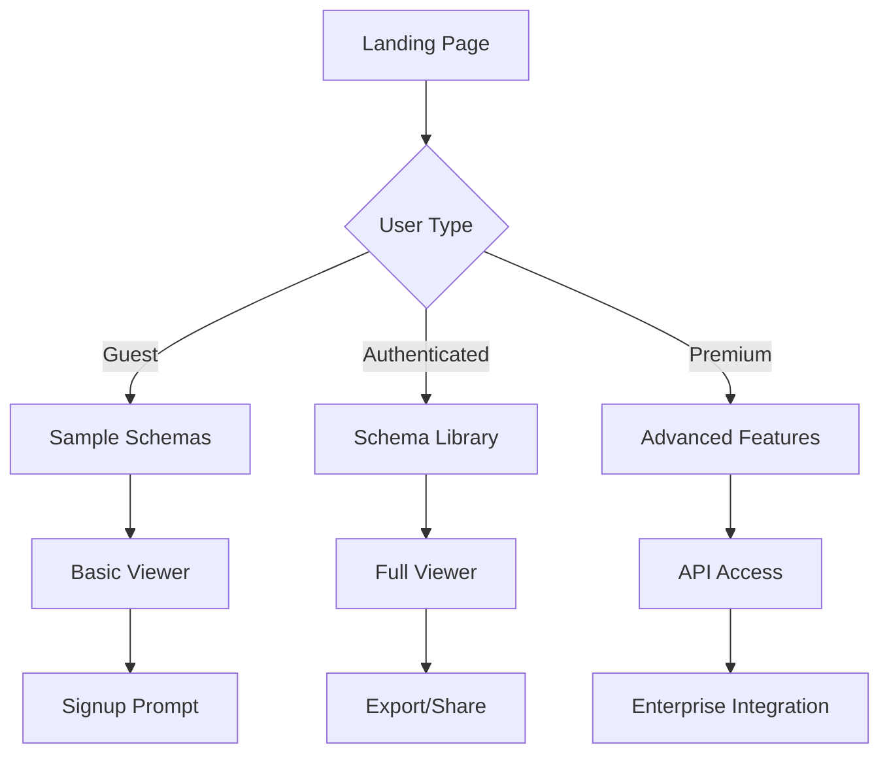

## 1. Product Overview
Interactive schema visualization tool that transforms complex data structures into intuitive, explorable visual representations. Enables users to understand, navigate, and analyze schema relationships through multiple visualization modes while maintaining clarity across all devices and zoom levels.

Target users: Developers, data architects, product managers, and technical stakeholders who need to understand and communicate data structures effectively.

## 2. Core Features

### 2.1 User Roles
| Role | Registration Method | Core Permissions |
|------|---------------------|------------------|
| Guest User | No registration required | View public schemas, basic navigation |
| Authenticated User | Email registration | Save preferences, export schemas, collaborate |
| Premium User | Subscription upgrade | Advanced layouts, unlimited schemas, API access |

### 2.2 Feature Module
Our interactive schema viewer consists of the following main pages:
1. **Schema Viewer**: Main visualization canvas with hierarchical tree/graph display, interactive nodes, and navigation controls.
2. **Schema Library**: Browse, upload, and manage multiple schema files with search and categorization.
3. **Settings Panel**: Customize visualization preferences, export options, and user preferences.

### 2.3 Page Details
| Page Name | Module Name | Feature description |
|-----------|-------------|---------------------|
| Schema Viewer | Visualization Canvas | Display schema as interactive tree/graph with zoom/pan controls, support multiple layout algorithms (hierarchical, force-directed, circular). |
| Schema Viewer | Node Interaction | Expand/collapse nodes with smooth animations, highlight relationships on hover, show detailed property panels on selection. |
| Schema Viewer | Visual Indicators | Color-code nodes by type (entity/field/relation), indicate required vs optional fields, display data type icons, show relationship connections. |
| Schema Viewer | Search & Filter | Real-time search across all schema elements, filter by type/status, highlight search results, save filter presets. |
| Schema Viewer | Navigation Controls | Zoom in/out with mouse wheel, fit-to-view button, minimap for large schemas, breadcrumb navigation for hierarchy. |
| Schema Library | Schema Management | Upload JSON/YAML schema files, organize schemas in folders, preview thumbnails, bulk operations. |
| Schema Library | Search & Browse | Search by name/description, filter by tags/date, sort by relevance/name/date, grid/list view toggle. |
| Settings Panel | Visualization Preferences | Choose default layout mode, set color themes, configure node spacing, enable/disable animations. |
| Settings Panel | Export Options | Export as PNG/SVG/PDF, generate documentation, copy schema JSON, share public links. |

## 3. Core Process
**Guest User Flow**: Landing page → Browse sample schemas → Interactive viewer → Basic navigation and exploration → Export limitations prompt signup.

**Authenticated User Flow**: Login → Access personal schema library → Upload/import schemas → Full interactive visualization → Save preferences → Export/share schemas → Collaborate with team members.

**Premium User Flow**: All authenticated features → API access for programmatic schema processing → Advanced layout algorithms → Unlimited schema storage → Priority support.

## 4. User Interface Design

### 4.1 Design Style
- **Primary Colors**: Deep blue (#1E40AF) for primary actions, light gray (#F3F4F6) for backgrounds
- **Secondary Colors**: Green (#10B981) for success/valid fields, red (#EF4444) for required/errors, orange (#F59E0B) for warnings
- **Typography**: Inter font family, 14px base size, clear hierarchy with font weights 400, 500, 600, 700
- **Button Style**: Rounded corners (8px radius), subtle shadows, hover animations, clear focus states
- **Layout**: Card-based design with consistent spacing (8px grid system), responsive breakpoints at 768px and 1024px
- **Icons**: Feather icon set for consistency, custom icons for schema-specific elements

### 4.2 Page Design Overview
| Page Name | Module Name | UI Elements |
|-----------|-------------|-------------|
| Schema Viewer | Canvas Area | Full-screen visualization with translucent toolbar overlay, dark mode support, smooth zoom transitions with CSS transforms. |
| Schema Viewer | Node Styling | Circular nodes for entities (40px), rectangular nodes for fields (80x30px), connection lines with animated flow effects, tooltip on hover with 300ms delay. |
| Schema Viewer | Control Panel | Floating sidebar with collapsible sections, icon-only mode for small screens, keyboard shortcut indicators. |
| Schema Library | Grid Layout | Responsive grid (1-4 columns based on screen size), card previews with schema thumbnails, hover effects with scale transform. |
| Settings Panel | Form Layout | Grouped settings with clear labels, toggle switches for boolean options, color picker with preset palettes, save/reset buttons. |

### 4.3 Responsiveness
Desktop-first design approach with mobile adaptation:
- Desktop (1024px+): Full feature set with side-by-side panels
- Tablet (768px-1023px): Collapsible sidebar, optimized touch targets
- Mobile (<768px): Stack layout, gesture-based navigation, simplified controls
- Touch optimization: 44px minimum touch targets, swipe gestures for navigation, pinch-to-zoom support

### 4.4 3D Scene Guidance
Not applicable - this is a 2D visualization application focused on schema relationships and hierarchical structures.