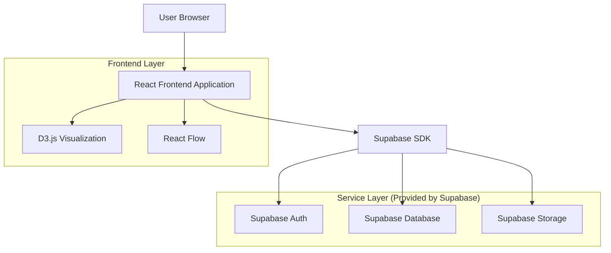
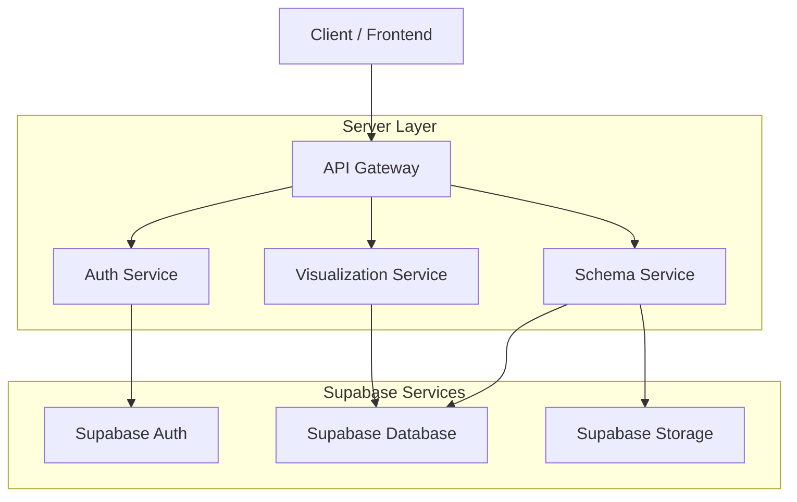
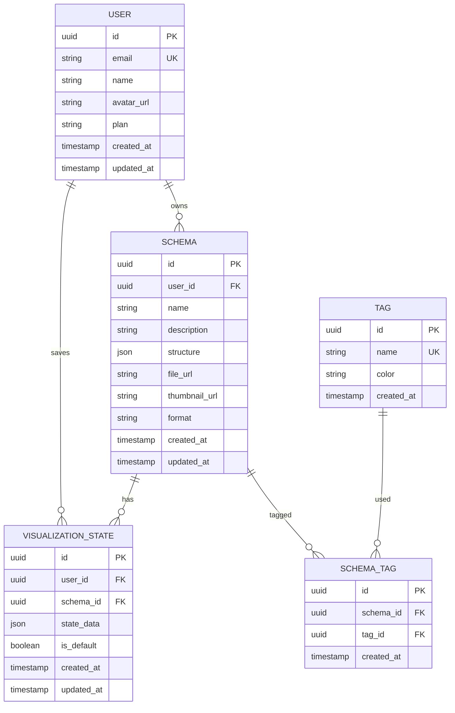

## 1. Architecture design



## 2. Technology Description
- Frontend: React@18 + TypeScript@5 + TailwindCSS@3 + Vite
- Initialization Tool: vite-init
- Visualization: D3.js@7 + React Flow@11 + Framer Motion@10
- Backend: Supabase (Authentication, Database, Storage)
- State Management: Zustand@4 + React Query@5
- UI Components: HeadlessUI@1 + Heroicons@2

## 3. Route definitions
| Route | Purpose |
|-------|---------|
| / | Landing page with feature overview and demo schemas |
| /viewer | Main schema visualization interface with interactive canvas |
| /library | Schema library for browsing and managing user schemas |
| /settings | User preferences and application configuration |
| /auth/login | User authentication page |
| /auth/register | User registration page |
| /auth/reset-password | Password reset functionality |

## 4. API definitions

### 4.1 Schema Management APIs

**Upload Schema**
```
POST /api/schemas/upload
```

Request:
| Param Name | Param Type | isRequired | Description |
|------------|------------|------------|-------------|
| file | File | true | Schema file (JSON/YAML) |
| name | string | true | Schema display name |
| description | string | false | Optional description |
| tags | string[] | false | Array of tags for categorization |

Response:
| Param Name | Param Type | Description |
|------------|------------|-------------|
| id | string | Unique schema identifier |
| url | string | Public URL for schema access |
| thumbnail | string | Generated thumbnail URL |

### 4.2 Visualization APIs

**Get Schema Structure**
```
GET /api/schemas/{id}/structure
```

Response:
| Param Name | Param Type | Description |
|------------|------------|-------------|
| nodes | Node[] | Array of schema nodes with properties |
| edges | Edge[] | Array of relationships between nodes |
| metadata | object | Schema metadata (version, format, etc.) |

**Save Visualization State**
```
POST /api/visualization/state
```

Request:
| Param Name | Param Type | isRequired | Description |
|------------|------------|------------|-------------|
| schemaId | string | true | Associated schema ID |
| layout | string | true | Current layout type (tree/graph/circular) |
| zoom | number | true | Current zoom level |
| position | object | true | Canvas position {x, y} |
| expandedNodes | string[] | false | Array of expanded node IDs |

## 5. Server architecture diagram



## 6. Data model

### 6.1 Data model definition



### 6.2 Data Definition Language

**Users Table**
```sql
-- create table
CREATE TABLE users (
    id UUID PRIMARY KEY DEFAULT gen_random_uuid(),
    email VARCHAR(255) UNIQUE NOT NULL,
    name VARCHAR(100) NOT NULL,
    avatar_url TEXT,
    plan VARCHAR(20) DEFAULT 'free' CHECK (plan IN ('free', 'premium', 'enterprise')),
    created_at TIMESTAMP WITH TIME ZONE DEFAULT NOW(),
    updated_at TIMESTAMP WITH TIME ZONE DEFAULT NOW()
);

-- create index
CREATE INDEX idx_users_email ON users(email);
CREATE INDEX idx_users_plan ON users(plan);
```

**Schemas Table**
```sql
-- create table
CREATE TABLE schemas (
    id UUID PRIMARY KEY DEFAULT gen_random_uuid(),
    user_id UUID REFERENCES users(id) ON DELETE CASCADE,
    name VARCHAR(255) NOT NULL,
    description TEXT,
    structure JSONB NOT NULL,
    file_url TEXT NOT NULL,
    thumbnail_url TEXT,
    format VARCHAR(20) CHECK (format IN ('json', 'yaml', 'xsd', 'avro')),
    created_at TIMESTAMP WITH TIME ZONE DEFAULT NOW(),
    updated_at TIMESTAMP WITH TIME ZONE DEFAULT NOW()
);

-- create index
CREATE INDEX idx_schemas_user_id ON schemas(user_id);
CREATE INDEX idx_schemas_created_at ON schemas(created_at DESC);
CREATE INDEX idx_schemas_name ON schemas(name);
```

**Visualization States Table**
```sql
-- create table
CREATE TABLE visualization_states (
    id UUID PRIMARY KEY DEFAULT gen_random_uuid(),
    user_id UUID REFERENCES users(id) ON DELETE CASCADE,
    schema_id UUID REFERENCES schemas(id) ON DELETE CASCADE,
    state_data JSONB NOT NULL,
    is_default BOOLEAN DEFAULT false,
    created_at TIMESTAMP WITH TIME ZONE DEFAULT NOW(),
    updated_at TIMESTAMP WITH TIME ZONE DEFAULT NOW(),
    UNIQUE(user_id, schema_id, is_default)
);

-- create index
CREATE INDEX idx_visualization_states_user_id ON visualization_states(user_id);
CREATE INDEX idx_visualization_states_schema_id ON visualization_states(schema_id);
```

**Tags Table**
```sql
-- create table
CREATE TABLE tags (
    id UUID PRIMARY KEY DEFAULT gen_random_uuid(),
    name VARCHAR(50) UNIQUE NOT NULL,
    color VARCHAR(7) DEFAULT '#6B7280',
    created_at TIMESTAMP WITH TIME ZONE DEFAULT NOW()
);

-- create table
CREATE TABLE schema_tags (
    id UUID PRIMARY KEY DEFAULT gen_random_uuid(),
    schema_id UUID REFERENCES schemas(id) ON DELETE CASCADE,
    tag_id UUID REFERENCES tags(id) ON DELETE CASCADE,
    created_at TIMESTAMP WITH TIME ZONE DEFAULT NOW(),
    UNIQUE(schema_id, tag_id)
);

-- Supabase Row Level Security Policies
-- Enable RLS
ALTER TABLE schemas ENABLE ROW LEVEL SECURITY;
ALTER TABLE visualization_states ENABLE ROW LEVEL SECURITY;

-- Create policies
CREATE POLICY "Users can view their own schemas" ON schemas
    FOR SELECT USING (auth.uid() = user_id);

CREATE POLICY "Users can insert their own schemas" ON schemas
    FOR INSERT WITH CHECK (auth.uid() = user_id);

CREATE POLICY "Users can update their own schemas" ON schemas
    FOR UPDATE USING (auth.uid() = user_id);

CREATE POLICY "Users can delete their own schemas" ON schemas
    FOR DELETE USING (auth.uid() = user_id);

-- Grant permissions
GRANT SELECT ON schemas TO anon;
GRANT ALL PRIVILEGES ON schemas TO authenticated;
GRANT SELECT ON visualization_states TO anon;
GRANT ALL PRIVILEGES ON visualization_states TO authenticated;
```