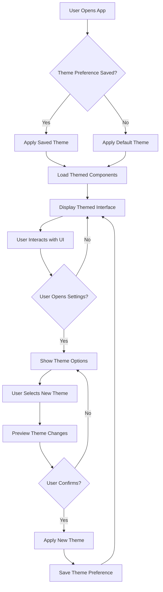

# Theme Integration System - Product Requirements Document

## 1. Product Overview

The Theme Integration System enables seamless sharing and synchronization of visual themes between the dashboard application and the Vanguard Mission Control app. This system ensures consistent branding, user experience, and design language across all applications in the ecosystem.

The system solves the problem of maintaining visual consistency across multiple applications while providing flexibility for theme customization and user preferences. It targets developers, designers, and end users who require a cohesive visual experience across the Vanguard application suite.

## 2. Core Features

### 2.1 User Roles

| Role | Registration Method | Core Permissions |
|------|---------------------|------------------|
| End User | App installation | Use themes, switch between available themes |
| Developer | Git repository access | Create and modify themes, integrate theme system |
| Designer | Design system access | Define color schemes, typography, component styles |
| Admin | Admin panel access | Manage theme library, approve theme changes |

### 2.2 Feature Module

The theme integration system consists of the following main components:

1. **Theme Configuration Manager**: Centralized theme definition and management
2. **Component Theme Library**: Pre-styled UI components with theme support
3. **Theme Switching Interface**: User controls for theme selection and customization
4. **Theme Synchronization Service**: Real-time theme updates across applications
5. **Theme Preview System**: Live preview of theme changes before application

### 2.3 Page Details

| Page Name | Module Name | Feature description |
|-----------|-------------|---------------------|
| Theme Settings | Theme Selector | Display available themes in grid or list format with preview thumbnails. Allow users to select and apply themes instantly. |
| Theme Settings | Customization Panel | Provide controls for adjusting primary colors, typography, spacing, and component-specific styles. Include color picker and font selector. |
| Theme Settings | Preview Mode | Show real-time preview of theme changes across different app screens. Include device size previews for responsive testing. |
| Dashboard | Themed Components | Apply integrated theme to all dashboard elements including room cards, sensor displays, control buttons, and status indicators. |
| Component Library | Theme Showcase | Display all themed components in isolation for testing and documentation purposes. Include usage examples and code snippets. |

## 3. Core Process

### Theme Integration Flow
1. **Theme Selection**: User browses available themes in settings
2. **Live Preview**: Theme changes previewed in real-time
3. **Application**: User confirms theme selection
4. **Synchronization**: Theme applied across all app components
5. **Persistence**: Theme preference saved for future sessions

### Developer Integration Flow
1. **Theme Definition**: Developer creates theme configuration files
2. **Component Integration**: Themed components implemented in UI
3. **Testing**: Theme consistency verified across different screens
4. **Documentation**: Theme usage documented for other developers
5. **Deployment**: Theme system deployed with application updates

## 4. User Interface Design

### 4.1 Design Style

**Color Palette**:
- Primary: Deep Blue (#1E88E5) - Main interactive elements
- Secondary: Light Blue (#64B5F6) - Supporting elements
- Success: Green (#4CAF50) - Positive status indicators
- Warning: Orange (#FF9800) - Attention elements
- Error: Red (#F44336) - Error states and alerts
- Background: Dark (#121212) - Main app background
- Surface: Medium Dark (#1E1E1E) - Cards and elevated surfaces

**Typography**:
- Font Family: Roboto (system default)
- Heading 1: 24px, Bold - Screen titles
- Heading 2: 20px, Bold - Section headers
- Body Large: 16px, Regular - Primary content
- Body Medium: 14px, Regular - Secondary content
- Button: 16px, Medium - Interactive elements

**Component Styling**:
- Cards: Rounded corners (8px), subtle elevation (2px)
- Buttons: Rounded corners (6px), consistent padding
- Icons: 20px default size, colored by semantic meaning
- Spacing: 4px base unit, consistent multiples throughout

### 4.2 Page Design Overview

| Page Name | Module Name | UI Elements |
|-----------|-------------|-------------|
| Theme Settings | Theme Grid | 2-column grid of theme cards with preview thumbnails, theme names, and selection indicators. Cards have subtle shadows and hover effects. |
| Theme Settings | Color Customization | Color picker wheel with hex input, preset color palettes, live preview swatch, and reset to default button. |
| Theme Settings | Typography Settings | Font family dropdown, size slider, weight selector, line height control, with live text preview. |
| Dashboard | Room Cards | Themed cards with sensor data rows, occupancy badges, control buttons with consistent spacing and colors. |
| Component Library | Component Showcase | Scrollable grid of themed components including buttons, cards, inputs, icons, with code examples and usage notes. |

### 4.3 Responsiveness

**Desktop-First Approach**:
- Base design optimized for desktop screens (1920x1080)
- Adaptive layouts for tablet (768px breakpoint)
- Mobile-optimized views (375px breakpoint)
- Touch-friendly controls with minimum 44px touch targets
- Responsive typography scaling based on screen size

### 4.4 Animation and Transitions

**Theme Switching Animation**:
- Duration: 300ms for smooth transitions
- Easing: Material Design standard curves
- Elements: Color interpolation, opacity fades, scale transitions
- Performance: Hardware-accelerated animations using Flutter's built-in capabilities

## 5. Technical Requirements

### 5.1 Performance Requirements
- Theme switching must complete within 500ms
- Initial theme load must not exceed 100ms
- Memory usage for theme system must stay under 10MB
- Theme preview must update at 60fps during customization

### 5.2 Compatibility Requirements
- Support Flutter 3.3.0 and higher
- Compatible with Android 6.0+ and iOS 11.0+
- Work with existing Provider state management
- Support both light and dark system themes

### 5.3 Accessibility Requirements
- Color contrast ratio minimum 4.5:1 for normal text
- Color contrast ratio minimum 3:1 for large text
- Support for screen readers and assistive technologies
- Keyboard navigation support for all theme controls
- High contrast mode support

## 6. Success Metrics

### 6.1 User Experience Metrics
- Theme switching completion rate >95%
- User satisfaction with theme options >4.0/5.0
- Time to apply theme <500ms (95th percentile)
- Theme-related support tickets <1% of total

### 6.2 Technical Metrics
- Theme system crash rate <0.1%
- Memory usage increase <10MB with full theme system
- Theme load time <100ms on average devices
- Code coverage for theme system >80%

### 6.3 Business Metrics
- Reduction in theme-related design inconsistencies >90%
- Developer productivity improvement in UI implementation >30%
- Time savings in cross-app theme maintenance >50%
- User engagement increase with customizable themes >15%

## 7. Future Enhancements

### 7.1 Advanced Customization
- User-created custom themes with sharing capabilities
- AI-powered theme suggestions based on usage patterns
- Seasonal and time-based automatic theme switching
- Integration with system-wide dark mode scheduling

### 7.2 Extended Platform Support
- Web platform theme synchronization
- Desktop application theme consistency
- Smartwatch and wearable device theme adaptation
- IoT device interface theme support

### 7.3 Enterprise Features
- Brand-specific theme templates
- Centralized theme management for organizations
- Theme approval workflows for enterprise environments
- Compliance and accessibility certification tools